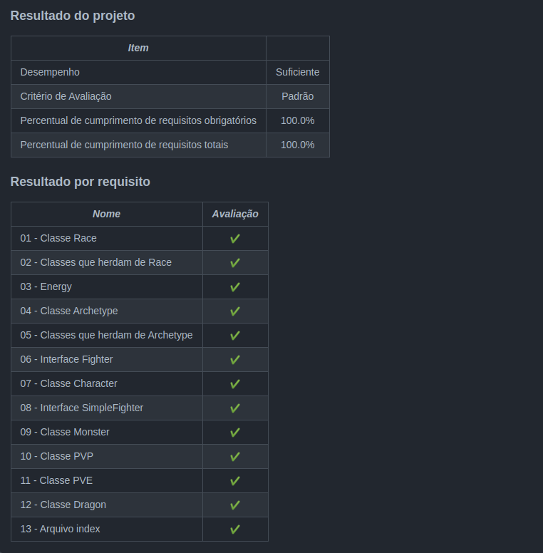

<h1>Sobre</h1>

Nono projeto do módulo 3 - Back-end, da <a href="https://betrybe.com" target="_blank">Trybe!</a>

Dessa vez foi o projeto Trybers and Dragons. O desafio foi construir uma estrutura de jogos de intepretação de papéis, mais conhecidos como RPG.

 Nesse projeto, iniciamos o desenvolvimento com base na Programação orientada a objetos (POO) e no SOLID 

<h1>Instalando</h1>

Para instalar, basta executar o comando <code>npm install</code> no diretório raiz do projeto.

Logo depois, rode o comando <code>docker-compose up</code>, também, no diretório raiz do projeto. 

Por fim, execute o comando <code>npm start</code>

<h1>Tecnologias utilizadas</h1>

<ul>
  <li>Node.js</li>
  <li>TypeScript</li>
  <li>POO</li>
  <li>SOLID</li>
</ul>

<h1>Nota</h1>

 
